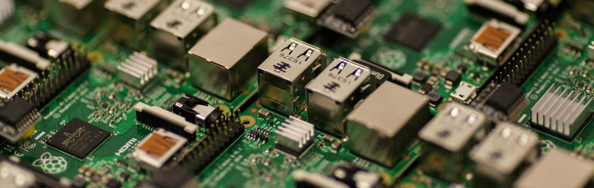

# Welcome! Let us meet each other 👋

### Computer enthusiast since a non-walking child. Linux down-to-the-bone explorer, FOSS news consumer.

I've always wondered, how *modern clickable applications worked* - how did humanity achieve mobile or interactive and intelligent apps, running on a computer only *understanding binary* symbols.
In middle school, coding in C++ did not provide me with the answer, yet the small algorithms and benchmarks I created felt like I had some power.
Also then I discovered some programmistical mysteries, like the asynchronous programming concept (how to do a snake game if the C++ cin object blocks input?) - unresolvable then.

My ongoing computer science studies clarified on many details how the programs communicate, what are the most common design patterns for all the big problems, and some interaction with the OS including graphic libraries, GUIs, and hardware use. But still there is so much more to learn and I am eager for it!

---

## My engineer profile

- 3rd year *Applied Computer Science* student at Politechnika Wrocławska
- Ongoing innovative **wearables motion capture** project for the Batchelor's degree: *sign language* VR application using the TeslaSuit and SenseGlove hardware
- Fundamentals in: ...
- Specializations

<!--
**voluxus/voluxus** is a ✨ _special_ ✨ repository because its `README.md` (this file) appears on your GitHub profile.

Here are some ideas to get you started:

- 🔭 I’m currently working on ...
- 🌱 I’m currently learning ...
- 👯 I’m looking to collaborate on ...
- 🤔 I’m looking for help with ...
- 💬 Ask me about ...
- 📫 How to reach me: ...
- 😄 Pronouns: ...
- ⚡ Fun fact: ...
-->
